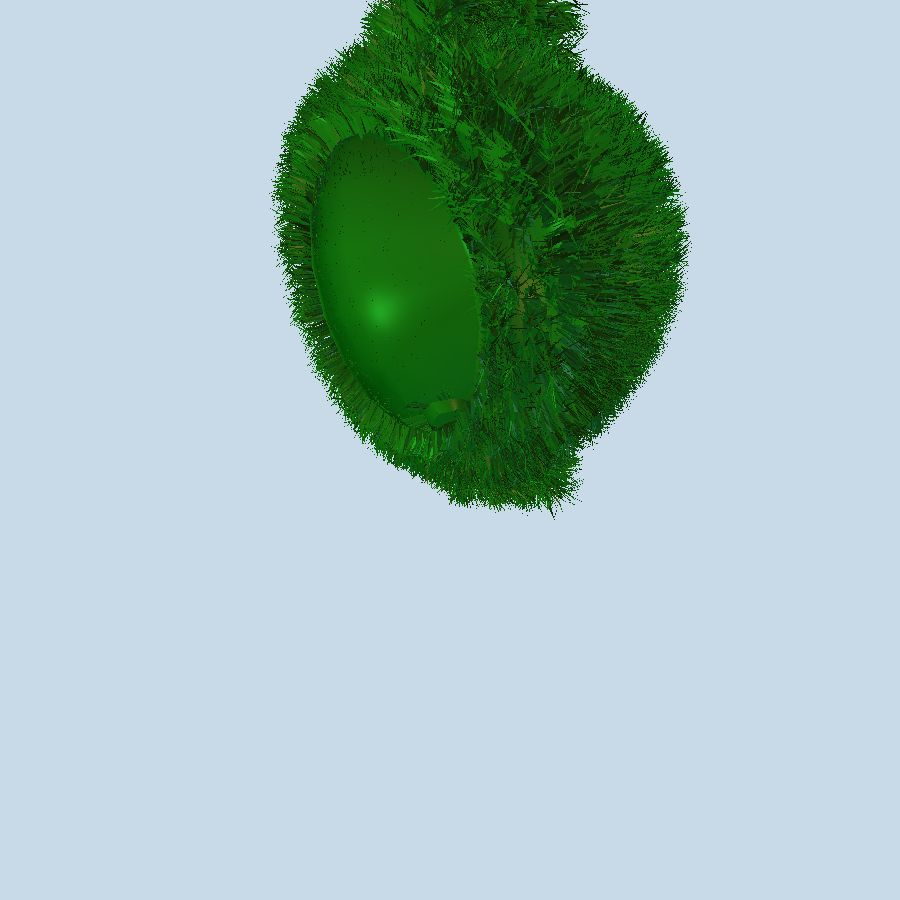
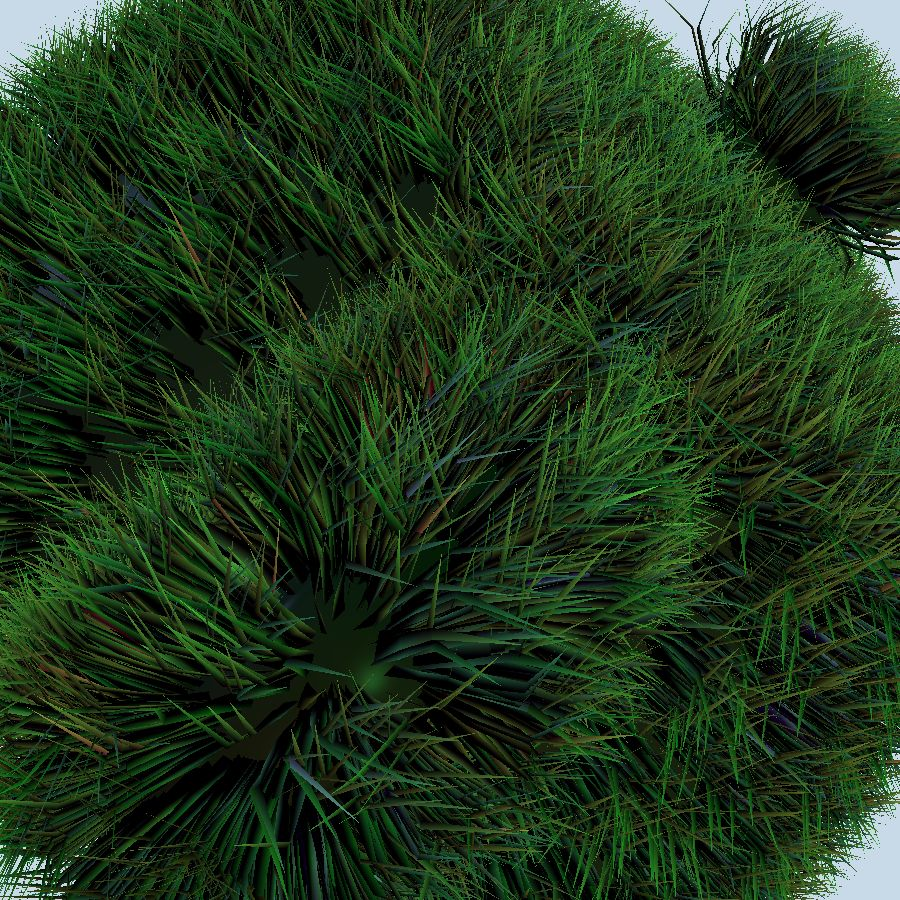

# Bend grass effect

## ptex_fun() with Gradient Color enhanced

_Application5.cpp_
``` cpp
#if 1  /* set up null texture function or valid pointer */
	valueListShader[5] = (GzPointer)0; /* Solid green */
#else
	//valueListShader[5] = (GzPointer)(tex_fun);	/* or grass texture */
	valueListShader[5] = (GzPointer)(ptex_fun);	/* or Gradient Color */
#endif
```

_tex_fun.cpp_
``` cpp
int ptex_fun(float u, float v, float w, GzColor color)
{

	if (w == 99) {
		color[0] = u * (0.7 - 0.1) + 0.1;
		color[1] = u * (0.9 - 0.1) + 0.1;
		color[2] = u * (0.7 - 0.1) + 0.1;
		return 0;
	}
	else {
		color[0] = 0.1;
		color[1] = 0.1;
		color[2] = 0.1;
		return 0;
	}

	return GZ_SUCCESS;
}
```

## Procedural texture
uv_solid_color_texture with 4 loop           |  uv_gradient_color_texture with 4 loop
:-------------------------:|:-------------------------:
 | 
 | 
