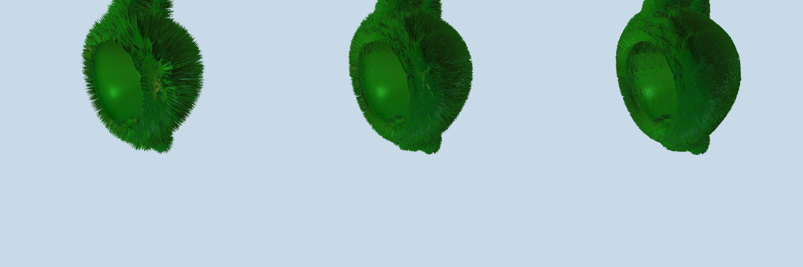

# Straight grass effect

## Chose of MidPoint
``` cpp
//Incentre of a Triangle
void getMid(GzCoord V1, GzCoord V2, GzCoord V3, float* mid) {
	float bc = sqrtf(powf(V2[0] - V3[0], 2) + powf(V2[1] - V3[1], 2) + powf(V2[2] - V3[2], 2));
	float ac = sqrtf(powf(V1[0] - V3[0], 2) + powf(V1[1] - V3[1], 2) + powf(V1[2] - V3[2], 2));
	float ab = sqrtf(powf(V2[0] - V1[0], 2) + powf(V2[1] - V1[1], 2) + powf(V2[2] - V1[2], 2));
	mid[0] = (bc * V1[0] + ac * V2[0] + ab * V3[0]) / (bc + ac + ab);
	mid[1] = (bc * V1[1] + ac * V2[1] + ab * V3[1]) / (bc + ac + ab);
	mid[2] = (bc * V1[2] + ac * V2[2] + ab * V3[2]) / (bc + ac + ab);
}

//Centroid of a Triangle
void getMidCentroid(GzCoord V1, GzCoord V2, GzCoord V3, float* mid) {
	mid[0] = (V1[0] + V2[0] + V3[0]) / 3;
	mid[1] = (V1[1] + V2[1] + V3[1]) / 3;
	mid[2] = (V1[2] + V2[2] + V3[2]) / 3;
}
```

## Centroid as MidPoint (3 recursion, 5 recursion & 7 recursion)


## Incentre as MidPoint (3 recursion, 5 recursion & 7 recursion)


