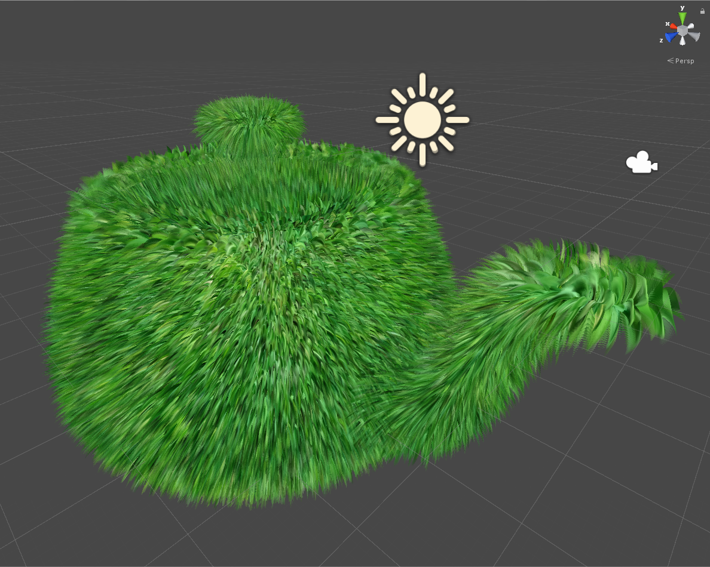

# Unity with grass effect

## Build
- Create new unity project
- Import as package
- Drag material into obj

## Reference

Modified from [edom18/Fur-shader-sample](https://github.com/edom18/Fur-shader-sample), please check the for more details