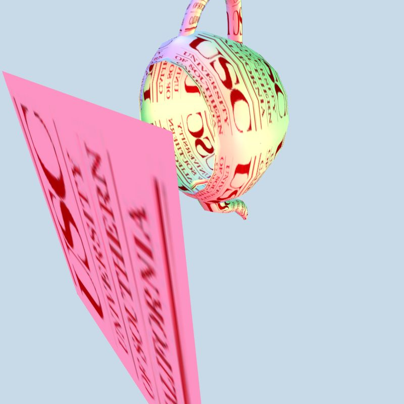
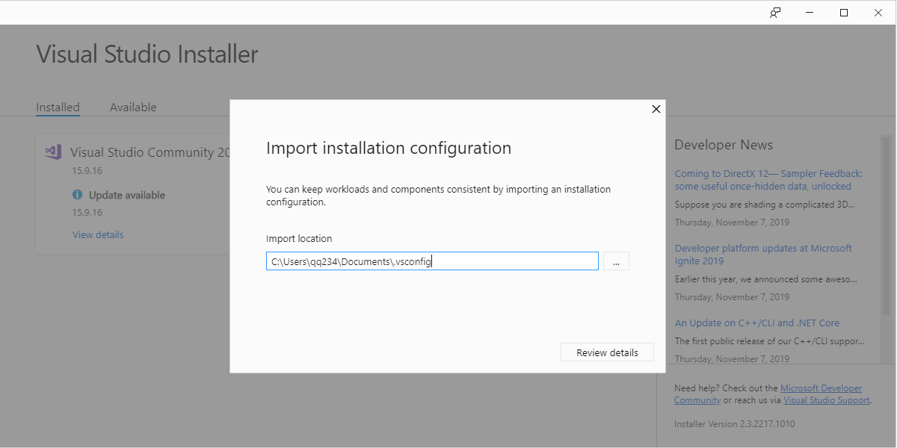

Lineng Cao - CSCI 580

linengca@usc.edu

---
## Features
- Scanline Algorithm for Rasterization
- Allow Scale, Rotate and Translation
- Implement three shadings with Flat, Phong & Gouraud
- Using external ppm image for texture, as well as programmed produced texture
- Simple anti-aliasing algorithm
- Output ppm image file

## Build
- Run `CS580HW5.sln`
- Need to switch to `release` instead of `debug` for building.

### Change image size
line `76` of `Application5.cpp`
```
m_nWidth = 256;		// frame buffer and display width
m_nHeight = 256;    // frame buffer and display height
```

### Adjust camera position
Toggle `1`, or `0` in line `111` of `Application5.cpp` for adjust camera default position
``` cpp
#if 1 	/* set up app-defined camera if desired, else use camera defaults */
...
#endif 
```

### Toogle Shading
Toogle Phong,  Gouraud or Flat shading in line `172` of `Application5.cpp`
``` cpp
//interpStyle = GZ_FLAT;           /* Flat shading */
//interpStyle = GZ_COLOR;         /* Gouraud shading */
interpStyle = GZ_NORMALS;         /* Phong shading */
```

### Toogle Texture Type
Toggle `1`, or `0` in line `185` to toogle texture, produced texture or shading options
``` cpp
#if 0   /* set up null texture function or valid pointer */
		valueListShader[5] = (GzPointer)0;
#else
		valueListShader[5] = (GzPointer)(tex_fun);	
        //valueListShader[5] = (GzPointer)(ptex_fun); /* ptex_fun as produced texture */
#endif
```

## Screenshot


## Development Environment
Visual Studio 2017 ver 15.9.16

### Environment configuration import

VS configuration [download](./.vsconfig)


