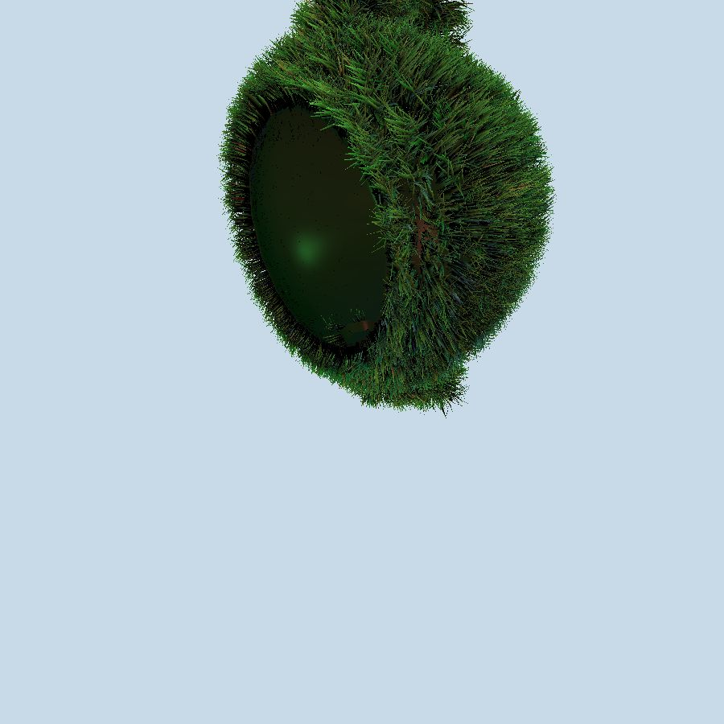

Lineng Cao - CSCI 580

linengca@usc.edu

---
## Features
- Scanline Algorithm for Rasterization
- Allow Scale, Rotate and Translation
- Implement three shadings with Flat, Phong & Gouraud
- Using external ppm image for texture, as well as programmed produced texture
- Simple anti-aliasing algorithm
- Output ppm image file

## Build
- Run `CS580HW5.sln`
- Need to switch to `release` instead of `debug` for building.

### Change image size
line `76` of `Application5.cpp`
```
m_nWidth = 256;		// frame buffer and display width
m_nHeight = 256;    // frame buffer and display height
```

### Adjust camera position
Toggle `1`, or `0` in line `111` of `Application5.cpp` for adjust camera default position
``` cpp
#if 1 	/* set up app-defined camera if desired, else use camera defaults */
...
#endif 
```

### Toogle Shading
Toogle Phong,  Gouraud or Flat shading in line `172` of `Application5.cpp`
``` cpp
//interpStyle = GZ_FLAT;           /* Flat shading */
//interpStyle = GZ_COLOR;         /* Gouraud shading */
interpStyle = GZ_NORMALS;         /* Phong shading */
```

### Toogle Texture Type
Toggle `1`, or `0` in line `185` to toogle texture, produced texture or shading options
``` cpp
#if 0   /* set up null texture function or valid pointer */
		valueListShader[5] = (GzPointer)0;
#else
		valueListShader[5] = (GzPointer)(tex_fun);	
        //valueListShader[5] = (GzPointer)(ptex_fun); /* ptex_fun as produced texture */
#endif
```

## Screenshot


---

# Final Project - Grass effect of Teapot
Teamed with [Shanshan Cai](https://github.com/shanshan3333333), [Sifan Geng](https://github.com/SifanGeng)

[Report](FinalProject\Report.pdf)

## Straight grass effect

### Chose of MidPoint
``` cpp
//Incentre of a Triangle
void getMid(GzCoord V1, GzCoord V2, GzCoord V3, float* mid) {
	float bc = sqrtf(powf(V2[0] - V3[0], 2) + powf(V2[1] - V3[1], 2) + powf(V2[2] - V3[2], 2));
	float ac = sqrtf(powf(V1[0] - V3[0], 2) + powf(V1[1] - V3[1], 2) + powf(V1[2] - V3[2], 2));
	float ab = sqrtf(powf(V2[0] - V1[0], 2) + powf(V2[1] - V1[1], 2) + powf(V2[2] - V1[2], 2));
	mid[0] = (bc * V1[0] + ac * V2[0] + ab * V3[0]) / (bc + ac + ab);
	mid[1] = (bc * V1[1] + ac * V2[1] + ab * V3[1]) / (bc + ac + ab);
	mid[2] = (bc * V1[2] + ac * V2[2] + ab * V3[2]) / (bc + ac + ab);
}

//Centroid of a Triangle
void getMidCentroid(GzCoord V1, GzCoord V2, GzCoord V3, float* mid) {
	mid[0] = (V1[0] + V2[0] + V3[0]) / 3;
	mid[1] = (V1[1] + V2[1] + V3[1]) / 3;
	mid[2] = (V1[2] + V2[2] + V3[2]) / 3;
}
```

### Centroid as MidPoint (3 recursion, 5 recursion & 7 recursion)


### Incentre as MidPoint (3 recursion, 5 recursion & 7 recursion)


## Bend grass effect

### ptex_fun() with Gradient Color enhanced

_Application5.cpp_
``` cpp
#if 1  /* set up null texture function or valid pointer */
	valueListShader[5] = (GzPointer)0; /* Solid green */
#else
	//valueListShader[5] = (GzPointer)(tex_fun);	/* or grass texture */
	valueListShader[5] = (GzPointer)(ptex_fun);	/* or Gradient Color */
#endif
```

_tex_fun.cpp_
``` cpp
int ptex_fun(float u, float v, float w, GzColor color)
{

	if (w == 99) {
		color[0] = u * (0.7 - 0.1) + 0.1;
		color[1] = u * (0.9 - 0.1) + 0.1;
		color[2] = u * (0.7 - 0.1) + 0.1;
		return 0;
	}
	else {
		color[0] = 0.1;
		color[1] = 0.1;
		color[2] = 0.1;
		return 0;
	}

	return GZ_SUCCESS;
}
```

### Procedural texture
uv_solid_color_texture with 4 loop           |  uv_gradient_color_texture with 4 loop
:-------------------------:|:-------------------------:
 | 
 | 

## Wind effect by normal mapping

### Involved timer and normal map texutre


### Procedural texture
Without Wind distortion          |  With Wind distortion
:-------------------------:|:-------------------------:
 | 


## Development Environment
Visual Studio 2017 ver 15.9.16

### Environment configuration import

VS configuration [download](./.vsconfig)


